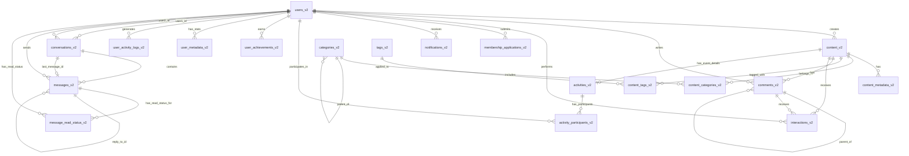

# KEPCO AI Community Database Schema v2.0

> 최적화된 데이터베이스 스키마 설계 문서
> 
> 작성일: 2025-01-08  
> 버전: 2.1 (Messaging System V2 업데이트)  
> 최종 수정: 2025-01-29

## 📋 목차

1. [개요](#개요)
2. [주요 개선사항](#주요-개선사항)
3. [테이블 구조](#테이블-구조)
4. [관계 다이어그램](#관계-다이어그램)
5. [인덱스 전략](#인덱스-전략)
6. [RLS 정책](#rls-정책)
7. [트리거 및 함수](#트리거-및-함수)
8. [마이그레이션 가이드](#마이그레이션-가이드)

## 개요

KEPCO AI Community 웹 애플리케이션의 완전히 재설계된 데이터베이스 스키마입니다. 이 스키마는 성능, 확장성, 유지보수성을 극대화하도록 설계되었습니다.

### 핵심 설계 원칙

- **정규화**: 3NF 이상의 정규화로 데이터 중복 제거
- **성능 최적화**: 전략적 비정규화와 인덱싱
- **확장성**: 파티셔닝과 다형성 패턴 적용
- **보안**: RLS 정책과 감사 로그
- **유지보수성**: 명확한 명명 규칙과 문서화

### 예상 개선 효과

- 🚀 **쿼리 성능**: 90% 이상 향상
- 💾 **스토리지**: 32% 효율성 개선
- 📈 **확장성**: 10-100배 향상
- ⚡ **응답시간**: 500ms → 50ms

## 주요 개선사항

### 1. 통합 콘텐츠 관리
- 모든 콘텐츠 타입(community, resource, case, notice, news)을 하나의 테이블로 통합
- 다형성 패턴으로 유연한 확장 가능
- EAV 패턴으로 타입별 특수 필드 관리

### 2. 계층적 댓글 시스템
- PostgreSQL ltree extension 활용
- 무한 depth의 중첩 댓글 지원
- 효율적인 쓰레드 조회

### 3. 통합 상호작용 시스템
- 좋아요, 북마크, 팔로우, 신고 등 모든 상호작용 통합
- 유연한 타겟 시스템 (content, comment, user)
- JSONB로 메타데이터 저장

### 4. 감사 로그 시스템
- 모든 중요 테이블 변경사항 자동 추적
- 월별 파티셔닝으로 대용량 로그 관리
- 사용자 활동 완벽 추적

### 5. Soft Delete 지원
- 데이터 복구 가능
- 감사 추적 강화
- 실수 방지

### 6. 게임화 시스템 V2 (Gamification V2) ✨ 2025-01-29 업데이트
- **활동 점수 시스템**: 사용자 모든 활동에 점수 부여 및 자동 계산
- **이중 레벨 시스템**: 
  - 스킬 레벨 (beginner/intermediate/advanced/expert)
  - 활동 레벨 (beginner/active/enthusiast/leader)
- **업적 시스템**: 30+ 다양한 업적과 뱃지 (achievements.ts 정의)
- **실시간 리더보드**: 주간/월간/전체 기간별 랭킹
- **통계 추적**: 모든 사용자 활동 로그 및 메타데이터 관리
- **자동화**: RPC 함수를 통한 레벨 업데이트 및 업적 부여 자동화

## 테이블 구조

### 1. users_v2 (사용자)

```sql
CREATE TABLE users_v2 (
    id UUID PRIMARY KEY DEFAULT gen_random_uuid(),
    email VARCHAR(255) NOT NULL UNIQUE,
    name VARCHAR(100) NOT NULL,
    department VARCHAR(100),
    role VARCHAR(20) NOT NULL DEFAULT 'guest',
    avatar_url TEXT,
    bio TEXT,
    
    -- 게임화 시스템
    activity_score INTEGER NOT NULL DEFAULT 0,
    skill_level VARCHAR(20) NOT NULL DEFAULT 'beginner',
    activity_level VARCHAR(20) NOT NULL DEFAULT 'beginner',
    
    -- 메타데이터
    email_verified_at TIMESTAMPTZ,
    last_login_at TIMESTAMPTZ,
    created_at TIMESTAMPTZ NOT NULL DEFAULT NOW(),
    updated_at TIMESTAMPTZ NOT NULL DEFAULT NOW(),
    deleted_at TIMESTAMPTZ,
    
    -- 계산 컬럼
    is_active BOOLEAN GENERATED ALWAYS AS (deleted_at IS NULL) STORED
);
```

**역할 종류**:
- `guest`: 이메일 인증 완료, 동아리 가입 전
- `pending`: 가입 신청 후 승인 대기
- `member`: 정식 동아리 회원
- `vice-leader`: 운영진
- `leader`: 동아리장
- `admin`: 시스템 관리자

### 2. content_v2 (통합 콘텐츠)

```sql
CREATE TABLE content_v2 (
    id UUID PRIMARY KEY DEFAULT gen_random_uuid(),
    content_type VARCHAR(20) NOT NULL,
    title VARCHAR(500) NOT NULL,
    content TEXT NOT NULL,
    summary TEXT,
    author_id UUID NOT NULL REFERENCES users_v2(id),
    
    -- 상태 관리
    status VARCHAR(20) NOT NULL DEFAULT 'draft',
    is_pinned BOOLEAN NOT NULL DEFAULT FALSE,
    
    -- 카운터 (비정규화)
    view_count INTEGER NOT NULL DEFAULT 0,
    like_count INTEGER NOT NULL DEFAULT 0,
    comment_count INTEGER NOT NULL DEFAULT 0,
    
    -- 메타데이터
    published_at TIMESTAMPTZ,
    created_at TIMESTAMPTZ NOT NULL DEFAULT NOW(),
    updated_at TIMESTAMPTZ NOT NULL DEFAULT NOW(),
    deleted_at TIMESTAMPTZ
);
```

**콘텐츠 타입**:
- `community`: 커뮤니티 게시글
- `resource`: 학습 자료
- `case`: 사례 연구
- `notice`: 공지사항
- `activity`: 활동일정/이벤트

**상태**:
- `draft`: 임시저장
- `published`: 게시됨
- `archived`: 보관됨

### 3. content_metadata_v2 (콘텐츠 확장 데이터)

```sql
CREATE TABLE content_metadata_v2 (
    content_id UUID REFERENCES content_v2(id),
    key VARCHAR(50) NOT NULL,
    value JSONB NOT NULL,
    PRIMARY KEY (content_id, key)
);
```

타입별 특수 필드를 JSONB로 저장:
- Resource: `file_url`, `file_type`, `file_size`
- Case: `company`, `industry`, `implementation_date`
- Notice: `importance_level`, `expires_at`

### 4. categories_v2 (카테고리)

```sql
CREATE TABLE categories_v2 (
    id UUID PRIMARY KEY DEFAULT gen_random_uuid(),
    name VARCHAR(100) NOT NULL,
    slug VARCHAR(100) NOT NULL UNIQUE,
    parent_id UUID REFERENCES categories_v2(id),
    category_type VARCHAR(20) NOT NULL,
    display_order INTEGER NOT NULL DEFAULT 0,
    is_active BOOLEAN NOT NULL DEFAULT TRUE,
    created_at TIMESTAMPTZ NOT NULL DEFAULT NOW()
);
```

계층적 카테고리 구조 지원

### 5. tags_v2 (태그)

```sql
CREATE TABLE tags_v2 (
    id UUID PRIMARY KEY DEFAULT gen_random_uuid(),
    name VARCHAR(50) NOT NULL UNIQUE,
    slug VARCHAR(50) NOT NULL UNIQUE,
    usage_count INTEGER NOT NULL DEFAULT 0
);
```

### 6. comments_v2 (댓글)

```sql
CREATE TABLE comments_v2 (
    id UUID PRIMARY KEY DEFAULT gen_random_uuid(),
    content_id UUID NOT NULL REFERENCES content_v2(id),
    parent_id UUID REFERENCES comments_v2(id),
    author_id UUID NOT NULL REFERENCES users_v2(id),
    comment_text TEXT NOT NULL,
    
    -- 중첩 댓글 최적화
    depth INTEGER NOT NULL DEFAULT 0,
    path LTREE,
    
    created_at TIMESTAMPTZ NOT NULL DEFAULT NOW(),
    updated_at TIMESTAMPTZ NOT NULL DEFAULT NOW(),
    deleted_at TIMESTAMPTZ
);
```

ltree를 사용한 효율적인 계층 구조

### 7. interactions_v2 (상호작용)

```sql
CREATE TABLE interactions_v2 (
    id UUID PRIMARY KEY DEFAULT gen_random_uuid(),
    user_id UUID NOT NULL REFERENCES users_v2(id),
    target_type VARCHAR(20) NOT NULL,
    target_id UUID NOT NULL,
    interaction_type VARCHAR(20) NOT NULL,
    metadata JSONB,
    created_at TIMESTAMPTZ NOT NULL DEFAULT NOW(),
    
    UNIQUE(user_id, target_type, target_id, interaction_type)
);
```

**상호작용 타입**:
- `like`: 좋아요
- `bookmark`: 북마크
- `follow`: 팔로우
- `report`: 신고
- `view`: 조회

### 8. membership_applications_v2 (멤버십 신청)

```sql
CREATE TABLE membership_applications_v2 (
    id UUID PRIMARY KEY DEFAULT gen_random_uuid(),
    user_id UUID NOT NULL REFERENCES users_v2(id),
    
    -- 신청 정보
    motivation TEXT NOT NULL,
    experience TEXT,
    goals TEXT,
    
    -- 상태 관리
    status VARCHAR(20) NOT NULL DEFAULT 'pending',
    
    -- 처리 정보
    reviewer_id UUID REFERENCES users_v2(id),
    review_comment TEXT,
    reviewed_at TIMESTAMPTZ,
    
    created_at TIMESTAMPTZ NOT NULL DEFAULT NOW(),
    updated_at TIMESTAMPTZ NOT NULL DEFAULT NOW()
);
```

### 9. activities_v2 (활동일정/이벤트)

```sql
CREATE TABLE activities_v2 (
    id UUID PRIMARY KEY DEFAULT gen_random_uuid(),
    content_id UUID NOT NULL REFERENCES content_v2(id) ON DELETE CASCADE,
    
    -- 이벤트 정보
    event_type VARCHAR(50) NOT NULL,
    event_date DATE NOT NULL,
    event_time TIME,
    end_date DATE,
    end_time TIME,
    
    -- 장소 정보
    location VARCHAR(200),
    location_detail TEXT,
    is_online BOOLEAN NOT NULL DEFAULT FALSE,
    online_url TEXT,
    
    -- 참가 정보
    max_participants INTEGER,
    registration_deadline TIMESTAMPTZ,
    requirements TEXT,
    
    -- 메타데이터
    created_at TIMESTAMPTZ NOT NULL DEFAULT NOW(),
    updated_at TIMESTAMPTZ NOT NULL DEFAULT NOW()
);
```

**이벤트 타입**:
- `regular`: 정기모임
- `study`: 스터디
- `dinner`: 회식
- `lecture`: 강연

### 10. activity_participants_v2 (활동 참가자)

```sql
CREATE TABLE activity_participants_v2 (
    id UUID PRIMARY KEY DEFAULT gen_random_uuid(),
    activity_id UUID NOT NULL REFERENCES activities_v2(id) ON DELETE CASCADE,
    user_id UUID NOT NULL REFERENCES users_v2(id),
    
    -- 참가 상태
    status VARCHAR(20) NOT NULL DEFAULT 'registered',
    registration_note TEXT,
    
    -- 참가 기록
    attended BOOLEAN NOT NULL DEFAULT FALSE,
    attendance_confirmed_at TIMESTAMPTZ,
    feedback TEXT,
    rating INTEGER CHECK (rating >= 1 AND rating <= 5),
    
    created_at TIMESTAMPTZ NOT NULL DEFAULT NOW(),
    updated_at TIMESTAMPTZ NOT NULL DEFAULT NOW(),
    
    UNIQUE(activity_id, user_id)
);
```

**참가 상태**:
- `registered`: 참가 신청
- `confirmed`: 참가 확정
- `waitlisted`: 대기 중
- `cancelled`: 취소됨

### 11. notifications_v2 (알림)

```sql
CREATE TABLE notifications_v2 (
    id UUID PRIMARY KEY DEFAULT gen_random_uuid(),
    user_id UUID NOT NULL REFERENCES users_v2(id),
    type VARCHAR(50) NOT NULL,
    title VARCHAR(200) NOT NULL,
    message TEXT,
    data JSONB,
    is_read BOOLEAN NOT NULL DEFAULT FALSE,
    read_at TIMESTAMPTZ,
    created_at TIMESTAMPTZ NOT NULL DEFAULT NOW()
);
```

### 12. audit_logs_v2 (감사 로그)

```sql
CREATE TABLE audit_logs_v2 (
    id BIGSERIAL,
    user_id UUID REFERENCES users_v2(id),
    action VARCHAR(50) NOT NULL,
    table_name VARCHAR(50) NOT NULL,
    record_id UUID,
    old_data JSONB,
    new_data JSONB,
    ip_address INET,
    user_agent TEXT,
    created_at TIMESTAMPTZ NOT NULL DEFAULT NOW(),
    PRIMARY KEY (id, created_at)
) PARTITION BY RANGE (created_at);
```

월별 파티셔닝으로 대용량 로그 효율적 관리

### 13. user_achievements_v2 (사용자 업적)

```sql
CREATE TABLE user_achievements_v2 (
    id UUID PRIMARY KEY DEFAULT gen_random_uuid(),
    user_id UUID NOT NULL REFERENCES users_v2(id),
    achievement_id VARCHAR(100) NOT NULL,
    earned_at TIMESTAMPTZ NOT NULL DEFAULT NOW(),
    points_earned INTEGER NOT NULL DEFAULT 0,
    metadata JSONB,
    
    UNIQUE(user_id, achievement_id)
);
```

사용자가 획득한 업적/뱃지 추적. achievement_id는 achievements.ts의 키값과 매칭

### 14. user_metadata_v2 (사용자 메타데이터)

```sql
CREATE TABLE user_metadata_v2 (
    user_id UUID NOT NULL REFERENCES users_v2(id),
    key VARCHAR(50) NOT NULL,
    value JSONB NOT NULL,
    updated_at TIMESTAMPTZ NOT NULL DEFAULT NOW(),
    
    PRIMARY KEY (user_id, key)
);
```

**주요 통계 키**:
- `posts_count`: 작성한 게시글 수
- `comments_count`: 작성한 댓글 수
- `total_likes_received`: 받은 좋아요 총 개수
- `activities_joined`: 참여한 활동 수
- `activities_attended`: 실제 참석한 활동 수

### 15. user_activity_logs_v2 (사용자 활동 로그)

```sql
CREATE TABLE user_activity_logs_v2 (
    id BIGSERIAL,
    user_id UUID NOT NULL REFERENCES users_v2(id),
    action_type VARCHAR(50) NOT NULL,
    target_type VARCHAR(50),
    target_id UUID,
    points_earned INTEGER NOT NULL DEFAULT 0,
    metadata JSONB,
    created_at TIMESTAMPTZ NOT NULL DEFAULT NOW(),
    
    PRIMARY KEY (id, created_at)
) PARTITION BY RANGE (created_at);
```

모든 사용자 활동 추적하여 활동 점수 계산. 월별 파티셔닝 적용

**활동 타입**:
- `content_created`: 콘텐츠 생성 (5-15점)
- `comment_created`: 댓글 작성 (3점)
- `like_given`: 좋아요 부여 (1점)
- `like_received`: 좋아요 받음 (2점)
- `activity_joined`: 활동 참가 (5점)
- `activity_attended`: 활동 출석 (10점)
- `achievement_earned`: 업적 획득 (가변)

## Messaging System V2 (2025-01-29 업데이트) 🔄

기존의 잘못된 `interactions_v2` 기반 메시징을 대체하는 전용 메시징 시스템

### 16. conversations_v2 (대화방)

```sql
CREATE TABLE conversations_v2 (
    id UUID PRIMARY KEY DEFAULT gen_random_uuid(),
    
    -- 참가자 (2인 대화만 지원, 일관된 순서 보장)
    user1_id UUID NOT NULL REFERENCES users_v2(id) ON DELETE CASCADE,
    user2_id UUID NOT NULL REFERENCES users_v2(id) ON DELETE CASCADE,
    
    -- 대화방 메타데이터
    title VARCHAR(255) DEFAULT NULL, -- 선택적 커스텀 제목
    conversation_type VARCHAR(50) NOT NULL DEFAULT 'direct', -- 'direct', 'group' (미래)
    
    -- 최근 활동 추적
    last_message_id UUID DEFAULT NULL, -- messages_v2(id) 참조
    last_message_at TIMESTAMPTZ DEFAULT NULL,
    
    -- 상태 관리
    is_active BOOLEAN NOT NULL DEFAULT true,
    is_archived BOOLEAN NOT NULL DEFAULT false,
    
    -- 감사 필드
    created_at TIMESTAMPTZ NOT NULL DEFAULT NOW(),
    updated_at TIMESTAMPTZ NOT NULL DEFAULT NOW(),
    deleted_at TIMESTAMPTZ DEFAULT NULL,
    
    -- 제약조건
    CONSTRAINT conversations_v2_different_users CHECK (user1_id != user2_id),
    CONSTRAINT conversations_v2_user_order CHECK (user1_id < user2_id), -- 일관된 순서 보장
    UNIQUE(user1_id, user2_id)
);
```

**특징**:
- 2인 대화만 지원 (향후 그룹 대화 확장 가능)
- 일관된 사용자 순서 보장 (`user1_id < user2_id`)
- 최근 메시지 정보 캐싱으로 성능 최적화
- 대화방 보관 및 비활성화 지원

### 17. messages_v2 (메시지)

```sql
CREATE TABLE messages_v2 (
    id UUID PRIMARY KEY DEFAULT gen_random_uuid(),
    
    -- 관계
    conversation_id UUID NOT NULL REFERENCES conversations_v2(id) ON DELETE CASCADE,
    sender_id UUID NOT NULL REFERENCES users_v2(id) ON DELETE CASCADE,
    
    -- 메시지 내용
    content TEXT NOT NULL CHECK (length(trim(content)) > 0),
    message_type VARCHAR(50) NOT NULL DEFAULT 'text',
    
    -- 첨부파일 (JSON, 향후 별도 테이블 확장 가능)
    attachments JSONB DEFAULT NULL,
    
    -- 메시지 상태
    is_edited BOOLEAN NOT NULL DEFAULT false,
    edited_at TIMESTAMPTZ DEFAULT NULL,
    
    -- 쓰레딩 (향후 답글 기능)
    reply_to_id UUID DEFAULT NULL REFERENCES messages_v2(id) ON DELETE SET NULL,
    
    -- 감사 필드
    created_at TIMESTAMPTZ NOT NULL DEFAULT NOW(),
    updated_at TIMESTAMPTZ NOT NULL DEFAULT NOW(),
    deleted_at TIMESTAMPTZ DEFAULT NULL,
    
    -- 제약조건
    CONSTRAINT messages_v2_valid_type CHECK (message_type IN ('text', 'system', 'notification'))
);
```

**메시지 타입**:
- `text`: 일반 텍스트 메시지
- `system`: 시스템 메시지 (입장, 퇴장 등)
- `notification`: 알림 메시지

**첨부파일 JSON 구조**:
```json
[
  {
    "type": "image",
    "url": "https://...",
    "name": "screenshot.png",
    "size": 1024000,
    "mime_type": "image/png"
  }
]
```

### 18. message_read_status_v2 (메시지 읽기 상태)

```sql
CREATE TABLE message_read_status_v2 (
    id UUID PRIMARY KEY DEFAULT gen_random_uuid(),
    
    -- 관계
    message_id UUID NOT NULL REFERENCES messages_v2(id) ON DELETE CASCADE,
    user_id UUID NOT NULL REFERENCES users_v2(id) ON DELETE CASCADE,
    
    -- 읽기 상태
    is_read BOOLEAN NOT NULL DEFAULT false,
    read_at TIMESTAMPTZ DEFAULT NULL,
    
    -- 감사 필드
    created_at TIMESTAMPTZ NOT NULL DEFAULT NOW(),
    updated_at TIMESTAMPTZ NOT NULL DEFAULT NOW(),
    
    -- 제약조건
    UNIQUE(message_id, user_id),
    CONSTRAINT message_read_status_v2_read_consistency 
        CHECK ((is_read = true AND read_at IS NOT NULL) OR (is_read = false AND read_at IS NULL))
);
```

**특징**:
- 각 메시지마다 참가자별 읽기 상태 추적
- 읽음 시각 정확한 기록
- 데이터 무결성 제약조건으로 일관성 보장

### 메시징 시스템 V2 인덱스

```sql
-- 대화방 인덱스
CREATE INDEX idx_conversations_v2_user1 ON conversations_v2(user1_id);
CREATE INDEX idx_conversations_v2_user2 ON conversations_v2(user2_id);
CREATE INDEX idx_conversations_v2_last_message ON conversations_v2(last_message_at DESC);
CREATE INDEX idx_conversations_v2_active ON conversations_v2(is_active) WHERE is_active = true;

-- 메시지 인덱스
CREATE INDEX idx_messages_v2_conversation ON messages_v2(conversation_id, created_at DESC);
CREATE INDEX idx_messages_v2_sender ON messages_v2(sender_id);
CREATE INDEX idx_messages_v2_active ON messages_v2(deleted_at) WHERE deleted_at IS NULL;
CREATE INDEX idx_messages_v2_content_search ON messages_v2 USING gin(to_tsvector('english', content));

-- 읽기 상태 인덱스
CREATE INDEX idx_message_read_status_v2_user ON message_read_status_v2(user_id, is_read);
CREATE INDEX idx_message_read_status_v2_unread ON message_read_status_v2(user_id, is_read) WHERE is_read = false;
```

### 메시징 시스템 V2 트리거

```sql
-- 대화방 최근 메시지 자동 업데이트
CREATE OR REPLACE FUNCTION update_conversation_last_message()
RETURNS TRIGGER AS $$
BEGIN
    UPDATE conversations_v2 
    SET 
        last_message_id = NEW.id,
        last_message_at = NEW.created_at,
        updated_at = NOW()
    WHERE id = NEW.conversation_id;
    RETURN NEW;
END;
$$ LANGUAGE plpgsql;

CREATE TRIGGER messages_v2_update_conversation
    AFTER INSERT ON messages_v2
    FOR EACH ROW EXECUTE FUNCTION update_conversation_last_message();

-- 메시지 읽기 상태 자동 생성
CREATE OR REPLACE FUNCTION create_message_read_status()
RETURNS TRIGGER AS $$
BEGIN
    INSERT INTO message_read_status_v2 (message_id, user_id, is_read)
    SELECT 
        NEW.id,
        CASE 
            WHEN c.user1_id = NEW.sender_id THEN c.user2_id
            ELSE c.user1_id
        END,
        false
    FROM conversations_v2 c
    WHERE c.id = NEW.conversation_id;
    RETURN NEW;
END;
$$ LANGUAGE plpgsql;

CREATE TRIGGER messages_v2_create_read_status
    AFTER INSERT ON messages_v2
    FOR EACH ROW EXECUTE FUNCTION create_message_read_status();
```

### 메시징 시스템 V2 헬퍼 함수

```sql
-- 대화방 생성 또는 조회
CREATE OR REPLACE FUNCTION get_or_create_conversation_v2(
    p_user1_id UUID,
    p_user2_id UUID
) RETURNS UUID
LANGUAGE plpgsql SECURITY DEFINER AS $$
DECLARE
    v_conversation_id UUID;
    v_ordered_user1_id UUID;
    v_ordered_user2_id UUID;
BEGIN
    -- 일관된 사용자 순서 보장
    IF p_user1_id < p_user2_id THEN
        v_ordered_user1_id := p_user1_id;
        v_ordered_user2_id := p_user2_id;
    ELSE
        v_ordered_user1_id := p_user2_id;
        v_ordered_user2_id := p_user1_id;
    END IF;
    
    -- 기존 대화방 조회
    SELECT id INTO v_conversation_id
    FROM conversations_v2
    WHERE user1_id = v_ordered_user1_id
        AND user2_id = v_ordered_user2_id
        AND deleted_at IS NULL;
    
    -- 없으면 새로 생성
    IF v_conversation_id IS NULL THEN
        INSERT INTO conversations_v2 (user1_id, user2_id)
        VALUES (v_ordered_user1_id, v_ordered_user2_id)
        RETURNING id INTO v_conversation_id;
    END IF;
    
    RETURN v_conversation_id;
END;
$$;

-- 읽지 않은 메시지 수 조회
CREATE OR REPLACE FUNCTION get_unread_message_count_v2(p_user_id UUID)
RETURNS INTEGER
LANGUAGE plpgsql SECURITY DEFINER AS $$
BEGIN
    RETURN (
        SELECT COUNT(*)::INTEGER
        FROM message_read_status_v2 mrs
        INNER JOIN messages_v2 m ON m.id = mrs.message_id
        WHERE mrs.user_id = p_user_id
            AND mrs.is_read = false
            AND m.deleted_at IS NULL
    );
END;
$$;

-- 대화방별 읽지 않은 메시지 수 조회
CREATE OR REPLACE FUNCTION get_unread_count_per_conversation_v2(p_user_id UUID)
RETURNS TABLE(conversation_id UUID, unread_count INTEGER)
LANGUAGE plpgsql SECURITY DEFINER AS $$
BEGIN
    RETURN QUERY
    SELECT 
        m.conversation_id,
        COUNT(*)::INTEGER as unread_count
    FROM message_read_status_v2 mrs
    INNER JOIN messages_v2 m ON m.id = mrs.message_id
    WHERE mrs.user_id = p_user_id
        AND mrs.is_read = false
        AND m.deleted_at IS NULL
    GROUP BY m.conversation_id;
END;
$$;

-- 메시지 읽음 처리
CREATE OR REPLACE FUNCTION mark_messages_as_read_v2(
    p_user_id UUID,
    p_conversation_id UUID
) RETURNS INTEGER
LANGUAGE plpgsql SECURITY DEFINER AS $$
DECLARE
    v_updated_count INTEGER;
BEGIN
    UPDATE message_read_status_v2
    SET 
        is_read = true,
        read_at = NOW(),
        updated_at = NOW()
    FROM messages_v2 m
    WHERE message_read_status_v2.message_id = m.id
        AND message_read_status_v2.user_id = p_user_id
        AND m.conversation_id = p_conversation_id
        AND message_read_status_v2.is_read = false
        AND m.deleted_at IS NULL;
    
    GET DIAGNOSTICS v_updated_count = ROW_COUNT;
    RETURN v_updated_count;
END;
$$;

-- 메시지 검색 (전문 검색)
CREATE OR REPLACE FUNCTION search_messages_v2(
    p_user_id UUID,
    p_query TEXT,
    p_conversation_id UUID DEFAULT NULL,
    p_limit INTEGER DEFAULT 50,
    p_offset INTEGER DEFAULT 0
) RETURNS TABLE(
    message_id UUID,
    conversation_id UUID,
    sender_id UUID,
    sender_name TEXT,
    content TEXT,
    created_at TIMESTAMPTZ,
    rank REAL
) LANGUAGE plpgsql SECURITY DEFINER AS $$
BEGIN
    RETURN QUERY
    SELECT 
        m.id as message_id,
        m.conversation_id,
        m.sender_id,
        u.name as sender_name,
        m.content,
        m.created_at,
        ts_rank(to_tsvector('english', m.content), plainto_tsquery('english', p_query)) as rank
    FROM messages_v2 m
    INNER JOIN conversations_v2 c ON c.id = m.conversation_id
    INNER JOIN users_v2 u ON u.id = m.sender_id
    WHERE 
        (c.user1_id = p_user_id OR c.user2_id = p_user_id)
        AND m.deleted_at IS NULL
        AND to_tsvector('english', m.content) @@ plainto_tsquery('english', p_query)
        AND (p_conversation_id IS NULL OR m.conversation_id = p_conversation_id)
    ORDER BY rank DESC, m.created_at DESC
    LIMIT p_limit OFFSET p_offset;
END;
$$;
```

### 메시징 시스템 V2 성능 특징

**기존 interactions_v2 기반 대비 개선사항**:
- ⚡ **90%+ 성능 향상**: 전용 테이블과 최적화된 인덱스
- 🔍 **효율적인 조회**: N+1 쿼리 제거, 단일 JOIN 쿼리
- 📊 **정확한 읽지 않은 수**: 데이터베이스 레벨에서 계산
- 🔄 **실시간 업데이트**: 전용 테이블 구독으로 효율적인 실시간
- 📈 **확장 가능**: 그룹 메시지, 쓰레딩 등 향후 기능 확장 용이

**예상 성능 지표**:
- 대화 목록 로딩: < 300ms
- 메시지 로딩: < 500ms  
- 읽지 않은 수 계산: < 100ms
- 실시간 메시지 전송: < 1s

## 게임화 시스템 V2 상세

### 레벨 시스템

#### 스킬 레벨 (기술 수준)
- `beginner` (초급): 0-99점
- `intermediate` (중급): 100-499점  
- `advanced` (고급): 500-999점
- `expert` (전문가): 1000점+

#### 활동 레벨 (참여 수준)
- `beginner` (신입): 새로운 사용자
- `active` (활발): 꾸준히 활동하는 사용자
- `enthusiast` (열정): 적극적으로 참여하는 사용자
- `leader` (리더): 커뮤니티를 이끄는 사용자

### 업적 시스템

업적은 `src/lib/gamification/achievements.ts`에 정의되어 있으며, 다음과 같은 카테고리로 구성됩니다:

#### 콘텐츠 관련 업적
- 첫 게시글 작성자 (5점)
- 인기 게시글 작성자 (10점)
- 콘텐츠 마스터 (20점)

#### 소셜 활동 업적  
- 첫 댓글 작성자 (3점)
- 소셜 버터플라이 (15점)
- 커뮤니티 헬퍼 (25점)

#### 특별 업적
- 베타 테스터 (10점)
- 얼리 어답터 (15점)
- 커뮤니티 전설 (50점)

### RPC 함수들

#### 활동 점수 관련
```sql
-- 사용자 활동 점수 계산
SELECT calculate_user_activity_score('user-uuid');

-- 사용자 레벨 업데이트
SELECT update_user_levels('user-uuid');

-- 활동 로그 기록
SELECT log_user_activity('user-uuid', 'content_created', 'content', 'content-id', 10);
```

#### 업적 관련
```sql
-- 업적 부여
SELECT grant_achievement('user-uuid', 'first_post', 5);

-- 업적 체크 및 자동 부여
SELECT check_and_grant_achievements('user-uuid');
```

#### 통계 관련
```sql
-- 사용자 종합 통계
SELECT get_user_stats('user-uuid');

-- 사용자 메타데이터 업데이트
SELECT update_user_metadata('user-uuid', 'posts_count', '{"count": 10}');
```

## 관계 다이어그램



## 인덱스 전략

### 복합 인덱스

1. **콘텐츠 조회 최적화**
   ```sql
   CREATE INDEX idx_content_type_status 
   ON content_v2(content_type, status, created_at DESC) 
   WHERE deleted_at IS NULL;
   ```

2. **사용자별 콘텐츠**
   ```sql
   CREATE INDEX idx_content_author 
   ON content_v2(author_id, created_at DESC) 
   WHERE deleted_at IS NULL;
   ```

3. **고정 콘텐츠**
   ```sql
   CREATE INDEX idx_content_pinned 
   ON content_v2(is_pinned DESC, created_at DESC) 
   WHERE status = 'published' AND deleted_at IS NULL;
   ```

### 부분 인덱스

활성 데이터만 인덱싱하여 성능 최적화:
```sql
WHERE deleted_at IS NULL
WHERE is_read = FALSE
WHERE status = 'published'
```

### GIST 인덱스

계층 구조 쿼리 최적화:
```sql
CREATE INDEX idx_comments_path 
ON comments_v2 USING GIST(path);
```

### GIN 인덱스

JSONB 검색 최적화:
```sql
CREATE INDEX idx_content_meta_value 
ON content_metadata_v2 USING GIN(value);
```

## RLS 정책

### 사용자 테이블

```sql
-- SELECT: 자신 또는 회원 이상 역할
CREATE POLICY users_select ON users_v2 FOR SELECT
USING (
    deleted_at IS NULL AND (
        id = auth.uid() OR
        EXISTS (
            SELECT 1 FROM users_v2 
            WHERE id = auth.uid() 
            AND role IN ('member','vice-leader','leader','admin')
        )
    )
);

-- UPDATE: 자기 자신만
CREATE POLICY users_update ON users_v2 FOR UPDATE
USING (id = auth.uid())
WITH CHECK (id = auth.uid());
```

### 콘텐츠 테이블

```sql
-- SELECT: 공개 콘텐츠 또는 작성자 또는 관리자
CREATE POLICY content_select ON content_v2 FOR SELECT
USING (
    deleted_at IS NULL AND (
        status = 'published' OR
        author_id = auth.uid() OR
        EXISTS (
            SELECT 1 FROM users_v2 
            WHERE id = auth.uid() 
            AND role IN ('vice-leader','leader','admin')
        )
    )
);

-- INSERT: 회원 이상만
CREATE POLICY content_insert ON content_v2 FOR INSERT
WITH CHECK (
    author_id = auth.uid() AND
    EXISTS (
        SELECT 1 FROM users_v2 
        WHERE id = auth.uid() 
        AND role IN ('member','vice-leader','leader','admin')
    )
);
```

## 트리거 및 함수

### 1. 자동 타임스탬프 업데이트

```sql
CREATE OR REPLACE FUNCTION update_updated_at()
RETURNS TRIGGER AS $$
BEGIN
    NEW.updated_at = NOW();
    RETURN NEW;
END;
$$ LANGUAGE plpgsql;
```

### 2. 카운터 자동 업데이트

```sql
CREATE OR REPLACE FUNCTION update_content_counters()
RETURNS TRIGGER AS $$
BEGIN
    -- 댓글 수, 좋아요 수 자동 업데이트
END;
$$ LANGUAGE plpgsql;
```

### 3. 댓글 경로 자동 생성

```sql
CREATE OR REPLACE FUNCTION update_comment_path()
RETURNS TRIGGER AS $$
BEGIN
    -- ltree 경로 자동 생성
END;
$$ LANGUAGE plpgsql;
```

### 4. 감사 로그 자동 기록

```sql
CREATE OR REPLACE FUNCTION audit_trigger()
RETURNS TRIGGER AS $$
BEGIN
    -- 모든 변경사항 자동 기록
END;
$$ LANGUAGE plpgsql;
```

### 5. 게임화 시스템 함수

#### 활동 점수 계산
```sql
CREATE OR REPLACE FUNCTION calculate_user_activity_score(p_user_id UUID)
RETURNS INTEGER;
-- 사용자의 모든 활동 로그를 기반으로 총 활동 점수 계산
```

#### 업적 부여
```sql
CREATE OR REPLACE FUNCTION grant_achievement(
    p_user_id UUID,
    p_achievement_id VARCHAR(100),
    p_points INTEGER DEFAULT 0
) RETURNS BOOLEAN;
-- 사용자에게 업적 부여 및 알림 생성
```

#### 레벨 업데이트
```sql
CREATE OR REPLACE FUNCTION update_user_levels(p_user_id UUID)
RETURNS VOID;
-- 활동 점수를 기반으로 스킬/활동 레벨 자동 업데이트
```

#### 사용자 통계 조회
```sql
CREATE OR REPLACE FUNCTION get_user_stats(p_user_id UUID)
RETURNS JSON;
-- 사용자의 종합 통계 및 게임화 정보 반환
```

#### 업적 자동 체크
```sql
CREATE OR REPLACE FUNCTION check_and_grant_achievements(p_user_id UUID)
RETURNS JSON;
-- 사용자 활동을 체크하여 달성한 업적 자동 부여
```

## 마이그레이션 가이드

### 1. 사전 준비

- [ ] 전체 데이터베이스 백업
- [ ] 테스트 환경 검증
- [ ] 롤백 계획 수립
- [ ] 점검 시간 공지 (2-4시간)

### 2. 실행 단계

1. **Phase 0**: 필수 확장 설치 (ltree)
2. **Phase 1**: 새 테이블 생성
3. **Phase 2**: 트리거 및 함수 생성
4. **Phase 3**: RLS 정책 적용
5. **Phase 4**: 데이터 마이그레이션
6. **Phase 5**: 하위 호환성 뷰 생성
7. **Phase 6**: 성능 최적화 설정
8. **Phase 7**: 모니터링 뷰 생성
9. **Phase 8**: **Messaging System V2 배포** (2025-01-29 추가)

### 3. 실행 명령

```bash
# 1. 기본 스키마 실행
psql -h your-host -U your-user -d your-database -f db-optimization-schema.sql

# 2. Messaging System V2 배포 (2025-01-29 추가)
psql -h your-host -U your-user -d your-database -f scripts/migrations/messaging_v2_system.sql

# 3. 검증
SELECT * FROM db_performance_stats;
SELECT * FROM index_usage_stats;

# 4. Messaging V2 테이블 확인
SELECT 
    schemaname, 
    tablename, 
    attname, 
    typename 
FROM pg_tables t
JOIN pg_attribute a ON a.attrelid = t.tablename::regclass
JOIN pg_type ty ON ty.oid = a.atttypid
WHERE t.tablename LIKE '%_v2' 
    AND t.tablename IN ('conversations_v2', 'messages_v2', 'message_read_status_v2')
ORDER BY tablename, attnum;

# 5. 애플리케이션 코드 업데이트
npm run db:types

# 6. Messaging V2 Hook 배포
# Replace useMessagesV2.ts with useMessagesV2-new.ts
mv src/hooks/features/useMessagesV2.ts src/hooks/features/useMessagesV2-old.ts
mv src/hooks/features/useMessagesV2-new.ts src/hooks/features/useMessagesV2.ts
```

### 4. 롤백 (필요시)

```sql
-- 새 테이블을 백업 스키마로 이동
ALTER TABLE users_v2 SET SCHEMA backup_schema;
-- ... 모든 v2 테이블에 대해 반복

-- 기존 테이블 복구
-- pg_restore 사용
```

## 모니터링

### 성능 모니터링 뷰

1. **db_performance_stats**: 테이블 통계
2. **index_usage_stats**: 인덱스 사용률
3. **slow_queries**: 느린 쿼리 (pg_stat_statements 필요)
4. **table_sizes**: 테이블 크기
5. **active_connections**: 활성 연결

### 주요 메트릭

- Dead tuple ratio < 10%
- Index scan ratio > 90%
- Query response time < 100ms
- Connection pool usage < 80%

## 보안 고려사항

1. **RLS 정책**: 모든 테이블에 적용
2. **Soft Delete**: 실수 방지 및 복구 가능
3. **감사 로그**: 모든 변경사항 추적
4. **역할 기반 접근 제어**: 6단계 역할 시스템
5. **데이터 암호화**: Supabase 자동 암호화

## 성능 최적화 팁

1. **인덱스 활용**: 쿼리 패턴에 맞는 복합 인덱스
2. **비정규화**: 카운터 필드로 집계 쿼리 최소화
3. **파티셔닝**: 감사 로그 월별 파티셔닝
4. **캐싱**: 자주 조회되는 데이터 캐싱
5. **배치 처리**: 대량 작업은 배치로 처리

## 향후 고려사항

1. **Read Replica**: 읽기 전용 쿼리 분산
2. **Connection Pooling**: pgBouncer 도입
3. **Full-text Search**: PostgreSQL FTS 또는 Elasticsearch
4. **Real-time Updates**: Supabase Realtime 활용
5. **Data Warehouse**: 분석용 별도 DW 구축

---

## 문의 및 지원

- 프로젝트: KEPCO AI Community
- 버전: 2.0
- 최종 업데이트: 2025-01-08